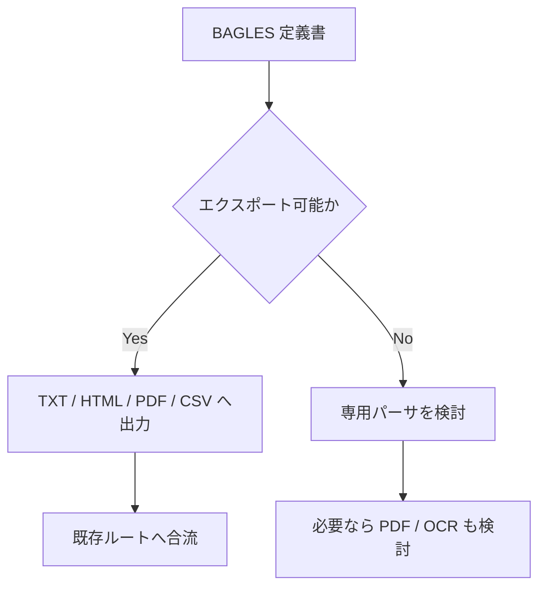

# BAGLES 定義書メモ

作成日: 260311 203032
更新日: 260311 212130

## 1. 結論

- BAGLES は、まず実ファイルの拡張子とエクスポート可否を確認する
- 現時点の提供物では `.bik` 8件、`.bca` 1件、`.bci` 1件、`.bpg` 1件の計 11 件を BAGLES として扱う
- エクスポートできるなら、既存ルートに載せられる形式へ寄せる方針を優先する
- 直接解析は、エクスポート不可の場合に限定して専用パーサを検討する

## 2. やり取り履歴

- `260311 101606`: BAGLES は Word や Excel と別物であり、独自形式として扱う必要があると整理した
- `260311 101606`: エクスポート優先、直接解析は次善策という順序を全体設計へ反映した
- `260311 203032`: 実拡張子未確定のままでも追記できるよう、専用メモとして分離した
- `260311 203256`: 結論先行と履歴保持の形式へ更新した
- `260311 211212`: 現在の提供ファイル内訳を反映し、`.bik/.bca/.bci/.bpg` を BAGLES 拡張子として明記した
- `260311 212130`: `BIK/BCA/BCI/BPG は BAGLES 扱い` で確定した前提に表現を更新した

## 3. 結論図

## 4. 再確認しやすい論点

- 実拡張子が何か
- `.bik / .bca / .bci / .bpg` を同一ルートで扱って問題ないか
- 公式ツールで一括エクスポートできるか
- 定義書種別ごとの共通レイアウトをパースできるか
- OCR を最終手段にした場合の品質が足りるか

## 5. 試験時の確認項目

- 実サンプルをテキストエディタで読めるか
- 公式ツールから一括エクスポートできるか
- 定義書種別ごとの共通レイアウトを抽出できるか

