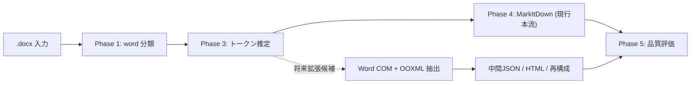

# .docx 取り扱いメモ

作成日: 260311 203032
更新日: 260311 214114

## 1. 結論

- 現行実装の正本は [詳細設計書 v2](../ドキュメント処理パイプライン詳細設計書_v2.md) とし、このメモでは Word 固有の論点と将来拡張候補を整理する
- 現行本流の `.docx` は Phase 4 の MarkItDown 変換で処理する
- 表、図形、フォーム部品、位置関係の保持が重要な文書では、将来拡張候補として `Word COM + OOXML 抽出` を検討する
- 将来拡張候補の抽出仕様は `paragraph / heading / table / cell / rowspan / colspan / shape / inline_shape / content_control / anchor / page_hint / bbox_hint` を基本単位とする
- Excel の `xlwings` に相当する Word 専用の定番ラッパは前提にせず、Word は `pywin32` による COM 直操作を主軸候補とする

## 2. やり取り履歴

- `260311 101606`: Word は見出し構造を活かせるため、MarkItDown 中心で扱う前提を全体設計へ反映した
- `260311 203032`: 拡張子別メモへ分離し、`.docx` を Word 系の基準文書とした
- `260311 203256`: 結論先行と履歴保持の形式へ更新した
- `260311 211420`: 構造保持が必要な Word は MarkItDown 単独ではなく、Word COM と OOXML 抽出を併用する方針を追記した
- `260311 214114`: 現行本流は MarkItDown、構造保持抽出は将来拡張候補という役割分担へ表現を整理した

## 3. 結論図

## 4. 再確認しやすい論点

- `文章型` と `構造保持型` をどの条件で自動判定するか
- 現行の MarkItDown ルートだけで、見出し・表中心の Word 文書をどこまで十分に扱えるか
- Word で `Shapes` / `InlineShapes` / `ContentControls` / `Tables` をどこまで網羅的に取得できるか
- 位置情報は絶対座標だけでなく、アンカー段落やページ情報を併用すべきか
- テキストボックスや図形、複雑な表をどこまで維持できるか
- 図が重要な文書で、本文だけでも仕様理解が成立するか
- Word スタイルが崩れた文書で見出し抽出を安定させられるか

## 5. 試験時の確認項目

- Heading 構造が Markdown 見出しへ正しく落ちるか
- 表が行列構造を保っているか
- 現行の MarkItDown ルートで仕様理解に必要な情報が欠けていないか
- 結合セルの `rowspan` / `colspan` を中間表現へ保持できるか
- テキストボックス、図形、画像、埋め込みオブジェクトを `shape` / `inline_shape` として追跡できるか
- 入力フォームや帳票で、ラベルと値の対応関係を再構成できるか
- 図や注釈の存在を後続工程で追跡できるか

## 6. 参照情報

- `2026-03-11` 参照: Speaker Deck `RAG x FINDY`。Excel を直接 Markdown 化するのではなく、中間表現を介して再構成する考え方の参考にした  
  https://speakerdeck.com/harumiweb/rag-findy
- `2026-03-11` 参照: xlwings `Book` / `Sheet` API。Excel 側の比較対象として確認した  
  https://docs.xlwings.org/en/latest/api/book.html  
  https://docs.xlwings.org/en/latest/api/sheet.html
- `2026-03-11` 参照: Microsoft Learn `Word Tables`。Word の表は COM で取得できる前提を確認した  
  https://learn.microsoft.com/en-us/office/vba/api/word.tables
- `2026-03-11` 参照: Microsoft Learn `Word Shape` / `Shapes`。浮動図形はアンカーを持ち、位置は `Top` / `Left` と相対位置で取得できる前提を確認した  
  https://learn.microsoft.com/en-us/office/vba/api/Word.Shape  
  https://learn.microsoft.com/office/vba/api/Word.shapes
- `2026-03-11` 参照: Microsoft Learn `InlineShapes`。インライン画像や OLE は Shape と別レイヤで扱う必要がある点を確認した  
  https://learn.microsoft.com/en-us/office/vba/api/Word.inlineshapes  
  https://learn.microsoft.com/en-us/office/vba/api/word.inlineshape
- `2026-03-11` 参照: Microsoft Learn `ContentControls`。Word の入力フォーム部品を COM で取得できる前提を確認した  
  https://learn.microsoft.com/en-us/office/vba/api/word.contentcontrols  
  https://learn.microsoft.com/en-us/office/vba/api/word.contentcontrol
- `2026-03-11` 参照: Microsoft Learn `Range.Information` / `WdInformation`。ページ番号や表内判定など、位置補助情報を取得できる前提を確認した  
  https://learn.microsoft.com/en-us/office/vba/api/word.range.information  
  https://learn.microsoft.com/en-us/office/vba/api/word.wdinformation
- `2026-03-11` 参照: python-docx `Working with Tables`。Word 表は merged cell と layout grid を持ち、単純な二次元配列へ潰すと意味を失う点を確認した  
  https://python-docx.readthedocs.io/en/latest/user/tables.html  
  https://python-docx.readthedocs.io/en/develop/api/table.html

