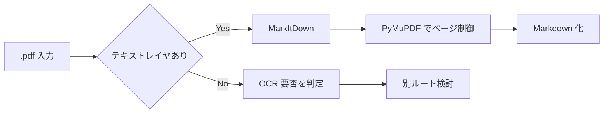

# .pdf 取り扱いメモ

作成日: 260311 203032
更新日: 260311 203256

## 1. 結論

- `.pdf` は、まずテキスト PDF とスキャン PDF を切り分けて扱う
- テキストレイヤを持つ PDF は MarkItDown を中心に処理し、ページ制御には PyMuPDF を併用する
- スキャン PDF は OCR 前提の別分岐候補として扱う

## 2. やり取り履歴

- `260311 101606`: PDF は MarkItDown とページ制御系ツールの併用が必要という前提を全体設計へ反映した
- `260311 203032`: `.pdf` を拡張子別メモへ分離し、テキスト PDF とスキャン PDF の分岐を明示した
- `260311 203256`: 結論先行と履歴保持の形式へ更新した

## 3. 結論図

## 4. 再確認しやすい論点

- 表、段組み、ヘッダ、フッタの崩れをどこまで許容するか
- スキャン PDF を自動で見分けられるか
- OCR を追加した場合のコストと品質をどう評価するか

## 5. 試験時の確認項目

- テキスト PDF とスキャン PDF を自動判定できるか
- ページ順序や段組みが崩れていないか
- 表が再構成不能な場合、どこまで許容するか判断できるか

