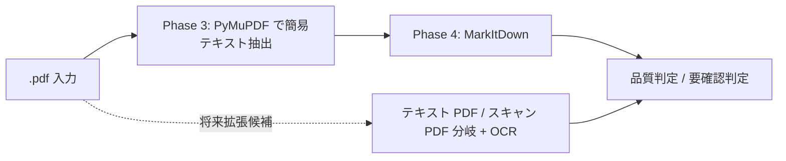

# .pdf 取り扱いメモ

作成日: 260311 203032
更新日: 260311 214114

## 1. 結論

- 現行実装の正本は [詳細設計書 v2](../ドキュメント処理パイプライン詳細設計書_v2.md) とし、このメモでは PDF 固有の論点と将来拡張候補を整理する
- 現行実装では、Phase 3 のトークン推定に `PyMuPDF` のテキスト抽出を使い、Phase 4 の Markdown 変換は `MarkItDown` を本流とする
- テキストレイヤが弱い PDF は品質低下や空抽出があり得るため、要確認対象として扱う
- テキスト PDF / スキャン PDF の事前分岐、OCR 追加、ページ単位の専用ルートは将来拡張候補とする

## 2. やり取り履歴

- `260311 101606`: PDF は MarkItDown とページ制御系ツールの併用が必要という前提を全体設計へ反映した
- `260311 203032`: `.pdf` を拡張子別メモへ分離し、テキスト PDF とスキャン PDF の分岐を明示した
- `260311 203256`: 結論先行と履歴保持の形式へ更新した
- `260311 214114`: 現行本流は MarkItDown、OCR や事前分岐は将来拡張候補として整理した

## 3. 結論図

## 4. 再確認しやすい論点

- 表、段組み、ヘッダ、フッタの崩れをどこまで許容するか
- 現行の MarkItDown ルートだけで本文理解に必要な情報が足りるか
- スキャン PDF を自動で見分けられるか
- OCR を追加した場合のコストと品質をどう評価するか

## 5. 試験時の確認項目

- テキストレイヤを持つ PDF で本文順序、ページ順序、段組みが崩れていないか
- テキスト抽出が弱い PDF を要確認対象として拾えるか
- 表が再構成不能な場合、どこまで許容するか判断できるか

