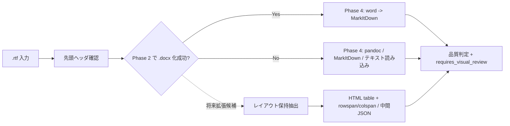

# .rtf 取り扱いメモ

作成日: 260311 202103
更新日: 260311 214114

## 1. 結論

- 現行実装の正本は [詳細設計書 v2](../ドキュメント処理パイプライン詳細設計書_v2.md) とし、このメモでは RTF 固有の論点と将来拡張候補を整理する
- 現行本流の `.rtf` は `Word COM で .docx 化 -> MarkItDown` で処理し、正規化失敗時のみフォールバック変換を使う
- `.rtf` は正規化起点のため、`source_type=rtf`、`normalized_from_rtf=true`、`fidelity_warnings`、`requires_visual_review` などのメタデータを残す方針を維持する
- フォーム型文書に対するレイアウト保持抽出と HTML テーブル保持は将来拡張候補とし、抽出仕様は原則として [`.docx 取り扱いメモ`](docx.md) と共通化する
- 標準 RTF 相当であることは、実ファイル先頭と Word での開封確認を前提とする
- ただし最終結論ではなく、実データで変換品質を見てから継続判断する

## 2. やり取り履歴

- `260311 202103`: 実ファイル先頭が `{\rtf1` で始まり、Microsoft Word で開けることを確認した
- `260311 202103`: Pandoc などの追加外部アプリは極力導入しない方針を整理した
- `260311 203032`: 拡張子別メモへ移し、他の拡張子メモと同じ管理単位に揃えた
- `260311 203256`: 結論先行、Mermaid 図、履歴保持の形式へ更新した
- `260311 205500`: セル結合の多い入力フォーム系 RTF は Markdown テーブル化せず、HTML テーブルで保持する方針を追記した
- `260311 211420`: `.rtf` は `.docx` と抽出仕様を共通化しつつ、正規化起点であることを示すメタデータを残す方針を追記した
- `260311 214114`: 現行本流は MarkItDown、レイアウト保持抽出は将来拡張候補という位置づけに整理した

## 3. 結論図

## 4. 再確認しやすい論点

- RTF から `.docx` へ保存した時点で複雑な表や図形が欠落しないか
- 現行の `Word COM で .docx 化 -> MarkItDown` だけで、実運用に必要な精度が足りるか
- `.docx` 共通仕様へ寄せた時に、RTF 起点だけ精度が落ちる項目は何か
- `.rtf` と `.docx` で同じ中間JSONを使いつつ、信頼度や要確認フラグをどう持つか
- セル結合の多いフォームを Markdown テーブルにしてよいのか、それとも HTML テーブルや JSON 構造で保持すべきか
- `.docx` から Markdown/HTML へ落とした時に図やオブジェクトの意味が失われないか
- Word ネイティブ文書と同じ品質で扱えるか
- 結果が悪い場合に RTF 専用ルートを増やすべきか

## 5. 試験時の確認項目

- 本文、見出し、表、箇条書きの順序が崩れていないか
- 正規化失敗時のフォールバックでも最低限の本文抽出ができるか
- 結合セルの `rowspan` / `colspan` が追跡できるか
- `source_type=rtf` や `fidelity_warnings` が後続工程へ渡っているか
- 図、フロー図、埋め込みオブジェクトが欠落していないか
- そのまま RAG 用データとして使えるか
- 人間が読んでも仕様理解できる品質か

## 6. 参照情報

- `2026-03-11` 参照: Speaker Deck `RAG x FINDY`。Excel と同様に、先に中間表現へ寄せてから再構成する考え方の参考にした  
  https://speakerdeck.com/harumiweb/rag-findy
- `2026-03-11` 参照: Microsoft Learn `Word Tables`。RTF を Word で開いた後、表を COM 経由で取得できる前提を確認した  
  https://learn.microsoft.com/en-us/office/vba/api/word.tables
- `2026-03-11` 参照: Microsoft Learn `Word Shape` / `Shapes` / `InlineShapes`。フォーム系 RTF の図形や画像を段落本文とは別に扱う必要がある点を確認した  
  https://learn.microsoft.com/en-us/office/vba/api/Word.Shape  
  https://learn.microsoft.com/office/vba/api/Word.shapes  
  https://learn.microsoft.com/en-us/office/vba/api/Word.inlineshapes  
  https://learn.microsoft.com/en-us/office/vba/api/word.inlineshape
- `2026-03-11` 参照: Microsoft Learn `ContentControls`。Word 上で再解釈されたフォーム部品を抽出対象に含める方針の参考にした  
  https://learn.microsoft.com/en-us/office/vba/api/word.contentcontrols  
  https://learn.microsoft.com/en-us/office/vba/api/word.contentcontrol
- `2026-03-11` 参照: Microsoft Learn `Range.Information` / `WdInformation`。位置関係は絶対座標だけでなく、ページ・表内判定などの補助情報も持たせる判断材料にした  
  https://learn.microsoft.com/en-us/office/vba/api/word.range.information  
  https://learn.microsoft.com/en-us/office/vba/api/word.wdinformation
- `2026-03-11` 参照: python-docx `Working with Tables`。RTF を `.docx` に正規化した後、結合セルを OOXML 側でも追跡できる前提を確認した  
  https://python-docx.readthedocs.io/en/latest/user/tables.html  
  https://python-docx.readthedocs.io/en/develop/api/table.html

