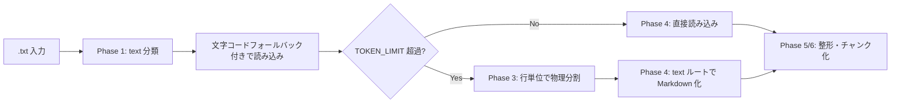

# .txt 取り扱いメモ

作成日: 260311 203032
更新日: 260311 214114

## 1. 結論

- 現行実装の正本は [詳細設計書 v2](../ドキュメント処理パイプライン詳細設計書_v2.md) とし、このメモではテキスト系の論点と将来拡張候補を整理する
- `.txt` は文字コードフォールバック付きの直接読み込みを基本とする
- 現行実装の Phase 3 では、`TOKEN_LIMIT` 超過時のみ行単位オーバーラップで物理分割する
- 段落単位や見出し推定による意味分割は将来拡張候補とする

## 2. やり取り履歴

- `260311 101606`: テキスト系は直接読み込みを基本にする方針を全体設計へ反映した
- `260311 203032`: `.txt` を拡張子別メモへ分離し、文字コード確認を明示した
- `260311 203256`: 結論先行と履歴保持の形式へ更新した
- `260311 214114`: 現行の行単位物理分割と、将来の意味分割候補を分けて整理した

## 3. 結論図

## 4. 再確認しやすい論点

- 文字コード判定の失敗をどう検知するか
- 行単位分割だけでログや長文テキストの文脈を十分に保てるか
- 1 行が極端に長いログをどう分割するか
- 見出しのない長文で分割境界をどう置くか

## 5. 試験時の確認項目

- 日本語文字化けが起きていないか
- 制御文字や不可視文字が残っていないか
- `TOKEN_LIMIT` 超過時の行単位分割で、前後文脈が失われすぎていないか
- 長文ログでも検索や要約に必要な文脈を保てているか

