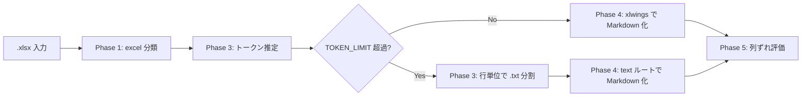

# .xlsx 取り扱いメモ

作成日: 260311 203032
更新日: 260311 214114

## 1. 結論

- 現行実装の正本は [詳細設計書 v2](../ドキュメント処理パイプライン詳細設計書_v2.md) とし、このメモでは Excel 固有の論点と将来拡張候補を整理する
- 現行実装では `.xlsx` も Phase 3 の意味単位分割は未実装であり、`TOKEN_LIMIT` 超過時のみ行単位で物理分割する
- 分割しない `.xlsx` は Phase 4 で `xlwings` によりシートごとの `used_range` を Markdown テーブル化する
- シート単位やテーブル単位での意味分割、結合セルや注記の構造保持強化は将来拡張候補とする

## 2. やり取り履歴

- `260311 101606`: Excel は MarkItDown 単独ではなく、専用ルートで扱う前提を全体設計に反映した
- `260311 203032`: 拡張子別メモへ分離し、`.xlsx` を Excel 系の基準文書として切り出した
- `260311 203256`: 結論先行、Mermaid 図、履歴保持の形式へ更新した
- `260311 214114`: 現行本流の `xlwings` ルートと、未実装の意味分割候補を分けて整理した

## 3. 結論図

## 4. 再確認しやすい論点

- Phase 3 で `.txt` 分割になった場合、シート境界や表構造の情報をどこまで失うか
- 結合セルをどこまで Markdown テーブルへ落とすか
- 背景色、コメント、フィルタ状態をどこまで意味情報として残すか
- 数式セルは表示値だけで十分か、式も残すべきか
- 1 シート内に複数テーブルがある場合の領域検出をどう安定させるか

## 5. 試験時の確認項目

- ヘッダ行とデータ行の対応が崩れていないか
- `TOKEN_LIMIT` 超過で `.txt` 分割になった場合、業務上必要な構造が失われていないか
- 結合セル由来の空欄や列ずれが読解不能になっていないか
- コメントや色の注記が過不足なく残っているか
- 巨大シートで将来的な意味分割が必要か判断できるか

